# Hi! 👋🏻 My name is Rehan Shah  

## Software Engineer

Helloooo! 👋 I'm Rehan — a Software Engineer based in Pakistan who loves building software.

Right now, I'm building app called Brainclean to fight mobile addiction and learning RUST programming language. 

Previously I built many full stack applications as well as AI agentic systems to automate tasks which company needed, using React.js and Python for building services I learned so many things from building products to deploy them on clouds like azure and GCP using docker. 

My philosophy is simple: learn the foundations, build strong logic, and the code will follow. Lastly do not use AI to write code and use it for assist to decision making.

I graduated with a BS in Computer Science from SZABIST in 2024, and I haven't stopped learning since.

* ✉️ Reach me at
* [rehan.shah70@yahoo.com](mailto:rehan.shah70@yahoo.com)
* [ra2445824@gmail.com](mailto:ra2445824@gmail.com)
* [https://x.com/RehanAS21](https://x.com/RehanAS21)
* [Linkedin](https://www.linkedin.com/in/rehan-shah-b405b9168/)

* 🌍 Programming from Karachi, Pakistan  
* 🧠 Currently learning RUST, Spring Boot & AI Engineering  
* ⚡ When I’m not programming, I’m playing chess or racing in NFS Heat  

---

### My States

<!--  -->

---

### 🛠️ My Skills

  
  
  
  
  
  
  
  
  
  
  
  
  
  
  
  
  

  

---

### 🌐 Find Me Also Here

  <!-- LinkedIn -->
  
  
  <!-- X (Twitter) - Dynamically switches Black/White based on theme -->
  

